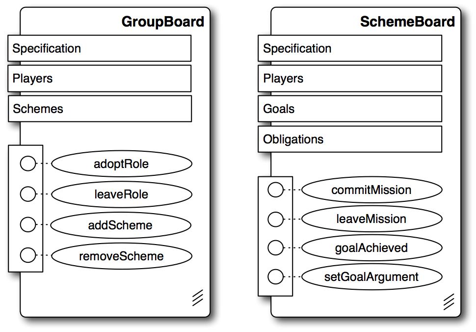
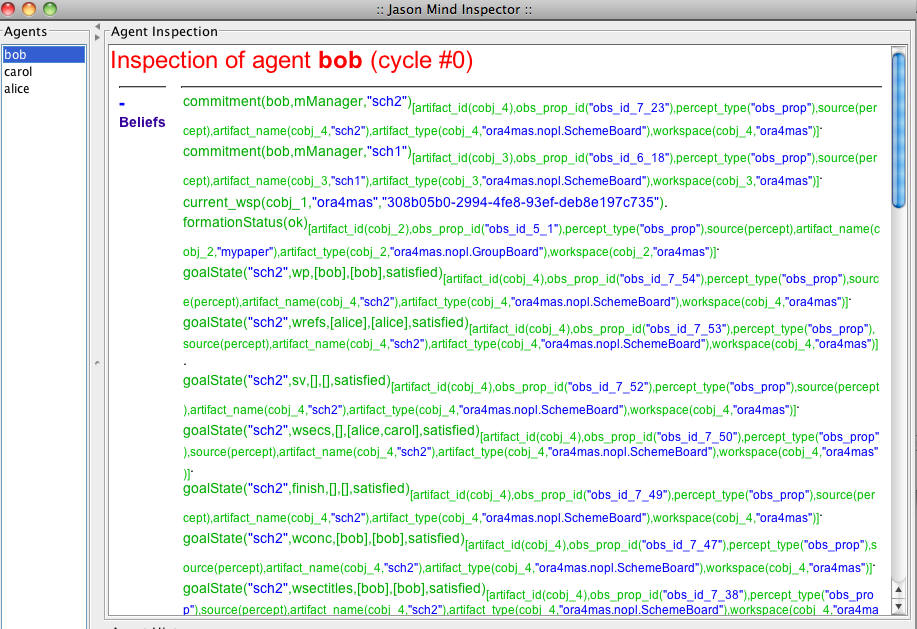

= ORA4MAS (Moise platform based on artifacts)
Basic Reference
:toc: right
:prewrap!:

== Introduction

This document briefly describes how to use the MOISE platform
based on CARTAGO. It follows the new approach to implement OMI
(Organisation Management Infrastructure): based on a normative
language and artifacts. The conceptual view of this approach is
presented in [cite:hubner09e], which is strongly based on ORA4MAS
[cite:hubner09c].

== A brief history of MOISE OMIs

- S-MOISE: a tier based centralised proposal. It adds an
  organisational layer on top of the communication layer. Agents use
  this new layer to interact/coordinate/.... It is centralised due a
  component called OrgManager that manages all the organisational
  layer [cite:hubner05a].
- SYNAI: an extension of S-MOISE with context specification and
  more suitable normative specification [cite:gateau07].
- J-MOISE (for S-MOISE): is the integration of S-MOISE for Jason
  agents [cite:hubner07].
- J-MOISE (for ORA4MAS): an integration of ORA4MAS with Jason
  similar to J-MOISE (for S-MOISE). This project was  discontinued,
  Jason agents access organisational artifacts as any other artifact.
- ORA4MAS: the OMI based on artifacts. In the initial version the
  organisational artifacts are implemented in Java
  [cite:hubner09c]. In a more recent version, the artifacts are
  programmed in https://github.com/jomifred/npl[NPL] (Normative Programming Language)
  [cite:hubner10b].

== Organisational Artifacts Specification

Two kinds of artifacts are implemented: `GroupBoard` and
`SchemeBoard`. The usage interface (operations, observable
properties, and signals) of them are available in the following links

- http://moise.sourceforge.net/doc/api/ora4mas/nopl/GroupBoard.html[Group API] and
- http://moise.sourceforge.net/doc/api/ora4mas/nopl/SchemeBoard.html[Scheme API] respectively.

== Java integration

There is a generic GUI to create organisational artifact and agents
enabling the user to test the specification. To run it:

    gradle intsim

We can then set the organisational specification for the system and
create groups, schemes, and generic GUI based agents.

You can also read the code of a simulator to learn how to program Java
agents to use these artifacts. The source is available
https://github.com/jomifred/moise/blob/master/src/main/java/ora4mas/nopl/simulator/ConsoleSimulator.java[here]
and can be run with

    gradle sim

== Jason Integration

=== Organisational actions

The actions are the action provided by the OrgArts like `adoptRole` and `commitMission`, etc.

=== Organisational perception

Observable properties of the artifacts (which are Java objects) are
mapped to the beliefs inside agents by Cartago-Jason bridge. All of
them are annotated with `artifact(_artifact id_)` as shown
in the mind inspector:

The beliefs are the following (see API documentation of artifacts for more details):

- `specification(....)` for http://moise.sourceforge.net/doc/api/moise/os/ss/Group.html#getAsProlog--[groups]
- `specification(....)` for http://moise.sourceforge.net/doc/api/moise/os/fs/Scheme.html#getAsProlog--[schemes]
- `play(agent, role, group)`
- `commitment(agent, mission, scheme)`
- `goalState(scheme, goal, list of committed agents, list of agent that performed the goal, state of the goal)`
- `obligation(agent,norm,goal,deadline)`: the current active obligations.
- others (see observable properties of the artifacts)

The following signals are also translated to Jason events (see the
organisational artifacts specification for more details):

- `oblCreated(obligation)`: the state of the obligation is changed to _created_
- `oblFulfilled(obligation)`
- `oblUnfulfilled(obligation)`
- `oblInactive(obligation)`
- `normFailure(details)`: some norm failure is thrown.
- `destroyed(artifact id)`: the artifact was destroyed.

=== Example

We use the traditional *writing paper* example to illustrate the
use of Jason - ORA4MAS integration [cite:hubner09c]. In this example
we have three agents:

- Bob: will create one group, and two schemes to write two
  papers. He adopts the role _editor_ in the group and the mission _mManager_ in the schemes.
- Alice: this agent waits for the group creation and then adopts
  the role _writer_ and commits to the missions _mColaborator_ and _mBib_.
- Carol: this agent also waits for the group creation and then adopts
  the role _writer_ and commits to the mission _mColaborator_.

The Jason project is:

[source,jcm]
.writing-paper.jcm
----
include::../../examples/writePaper/agents/writing-paper.jcm[]
----

The code of the agents follows.

[source,asl]
.bob.asl
----
include::../../examples/writePaper/agents/bob.asl[]
----

The included files are:

[source,asl]
.common-moise.asl
----
include::../../examples/writePaper/agents/common-moise.asl[]
----

[source,asl]
.common.asl
----
include::../../examples/writePaper/agents/common.asl[]
----

[source,asl]
.alice.asl
----
include::../../examples/writePaper/agents/alice.asl[]
----

[source,asl]
.carol.asl
----
include::../../examples/writePaper/agents/carol.asl[]
----

== References
[bibliography]
